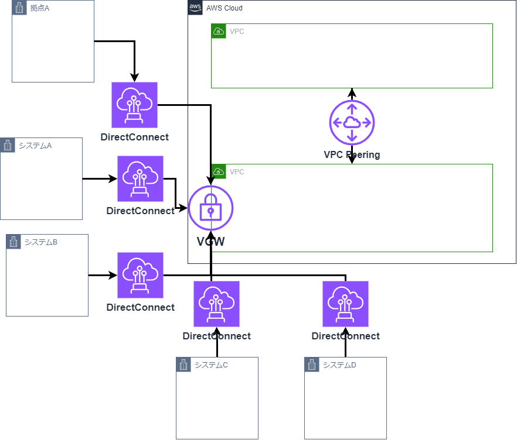

# クラウドネイティブ＆マイクロサービス塾活動  
## 塾の活動目的  
1.これまで塾長・塾生が蓄積してきたSpring/AWSをベースとした技術検証・ナレッジのトランスファーを通してトップ人材(フルスタックエンジニア)を育成  
2.初級〜中級技術者を対象とした育成コンテンツの整備・スキルマップの定義  
3.デジタル技術リファレンスアーキテクチャの整備・公開  

## 塾における技量レベル  
https://debugroom.github.io/technical-academy/kickoff/202310/slides/index.html#/6-1  

基盤系についてはGrade3近い知識はあるが、AP系はGrade1以下であり、Grade1すらハードルが高そうな感触である。  

# テーマ再検討(AWS)
spring学習の進捗が芳しくないため、AWSに特化したテーマの再検討を行う。  

## 案① NetworkFirewall/AWS WAF使ってみる  
利用したことがなく、興味もあるため。  

### 検証ポイント  

## 案② Trangitgateway使ってみる  
### 移行検討  
現状プロジェクトでTGW/DXGWを使わず、直接VGWに紐づけている。  
影響無く移行する手順を検討したい。  

### 移行前イメージ  

### 移行後イメージ  

### 検証ポイント  
・移行方式は何があるか。方式別で以下はどうなるか。  
・DirectConnectは流用可能か。  
・ダウンタイムはどのくらいか。  
・設定変更が必要な箇所はどこか。  
・コストに影響あるか。  
・その他懸念はあるか。  

## 案③ AWSサービス使ってみる  
使ったことが無いAWSサービスは数多く存在する。  
1つ1つ触ってみて簡易的なレポートを作成する。  

## 案④ ランニングコストを削減するための方法検討  
AWSで少しでもコストを削減したい時の方法について調査、検証する。  

### 検討候補  
以下公式アプローチ方式について  
参考：https://aws.amazon.com/jp/blogs/news/9ways-to-optimize-aws-cost/  
#### 1　未使用状態のAmazon EC2やAmazon RDS インスタンスへの支払いを止める  
#### 2　未使用状態のAmazon Redshift クラスターへの支払いを止める  
利用していない時間を停止することでコスト削減を図る。  
サービス別での対応方針などを調査、検討する。  

#### 3　Amazon S3 Intelligent-Tieringを有効にする  
S3標準ストレージではなく、低コストストレージを組み合わせることでコスト削減を図る。  
細かな設定をせずに、S3 Intelligent-Tieringを使用することで自動的に最適化をすることが可能。  
S3 Intelligent-Tieringの動作について検証してみるのもありかもしれない。  

#### 4　Amazon DynamoDB にはオンデマンドのキャパシティーモードを利用する  
#### 5　十分に活用されていないEC2 インスタンスへの支払いを止める  

#### 6　十分に活用されていないネットワークリソースを削除する  

#### 7　EC2 スポットインスタンスを利用する  
スポットインスタンスとは、AWSが用意している余剰リソースを、非常に安価で利用できるようにした購入オプションの1つである。  
安価である一方、AWS側のキャパシティーの都合により、停止となる可能性があるため、これらに対応できる方法で利用する必要がある。  
商用運用に耐えうるスポットインスタンスの利用方法について検討する。  

#### 8　Compute Savings Plans を利用する  
プランの話となるため、サービス概要を机上調査し、情報をまとめる。  

#### 9　リザーブドインスタンスを利用する  
プランの話となるため、サービス概要を机上調査し、情報をまとめる。  

## 案⑤ ランニングコストを監視する方式検討  
AWSのランニングコストの利用状況を監視する方式について調査、検証する。  

### 検証ポイント  

## 案⑥ AWSでセキュリティを守るためのベストプラクティス  
AWSセキュリティのベストプラクティスについて実際に調査、検証する。  

### 検証ポイント  

## 案⑦ AWS内のOSセキュリティのベストプラクティス  
AWS内部にサーバ構築した時のセキュリティ担保方法について調査、検証する。  

### 検証ポイント  

## 案⑧ NOA環境でのWorkspaces、Windows操作実現  
NOA環境でのWorkspaces、Windows操作をするための方式について調査、検証する。  

### 検証ポイント  

