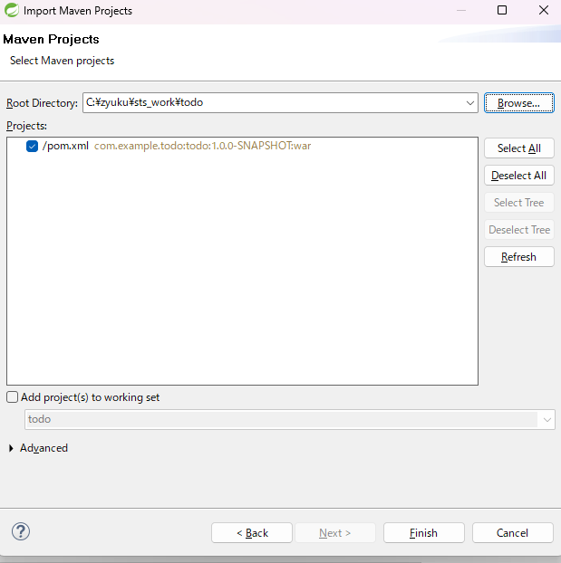

# TERASOLUNAチュートリアル
以下チュートリアルについての情報を記す。  
http://terasolunaorg.github.io/guideline/5.7.0.RELEASE/ja/Tutorial/TutorialTodo.html  

## 環境構築
### Spring Tool Suite(STS)
1,インストール
IDEとして「Spring Tool Suite」をインストールする。  
公式サイトからzipファイルをダウンロードし、任意のフォルダに解凍する。  
今回は「C:\zyuku」配下とする。  

※Windows標準機能での解凍では非常に時間がかかった。2時間くらい。Lhaplusを利用すると１分ほど。。。  
　解凍後のパスが長すぎてエラーとなった。LhaplusでCドライブ直下に解凍するとエラーなく解凍できた。  
　今回は解凍後に上記パスへと移動させた。  

2,起動
「C:\zyuku\sts-bundle\sts-3.9.18.RELEASE」配下の「STS.exe」を起動する。  
起動時にWorkspaceを求められる。とりあえず今回は「C:\zyuku\sts_work」とする。  

### Apache Maven
1,インストール  
Build Toolとして「Apache Maven」をインストールする。  
公式サイトからバイナリのzipファイルをダウンロードし、任意のフォルダに解凍する。  
今回は「C:\zyuku」配下とする。  

2,環境変数  
以下フォルダに解凍した場合は  
「C:\zyuku」  
以下を環境変数に追加する。  
```
C:\zyuku\apache-maven-3.9.5-bin\apache-maven-3.9.5\bin
```

コマンドプロンプトを開き、以下コマンドを実行し、パスが通っていることを確認する。  
```
mvn -version
```

環境変数「JAVA_HOME」が設定されていない場合はエラーとなるため注意すること。  
パスはbinまで通す必要はなく、今回は「C:\Program Files\Java\jdk-21」とする。  

## プロジェクト作成
1.O/R Mapperに依存しないブランクプロジェクトの作成
コマンドプロンプト(今回は誤ってanaconda prompt)より以下を実行する。結果はかなり長いため割愛する。  
```
cd  C:\zyuku\sts_work

mvn archetype:generate -B^
 -DarchetypeGroupId=org.terasoluna.gfw.blank^
 -DarchetypeArtifactId=terasoluna-gfw-web-blank-archetype^
 -DarchetypeVersion=5.7.0.RELEASE^
 -DgroupId=com.example.todo^
 -DartifactId=todo^
 -Dversion=1.0.0-SNAPSHOT
 ```

2.プロジェクトのインポート
STSのメニューから、[File] -> [Import] -> [Maven] -> [Existing Maven Projects] -> [Next]を選択し、archetypeで作成したプロジェクトを選択する。 
  

