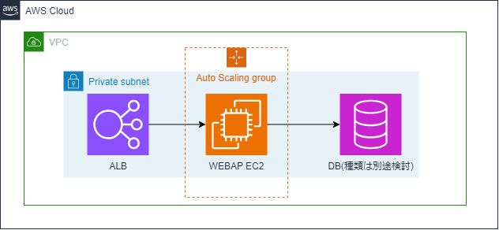
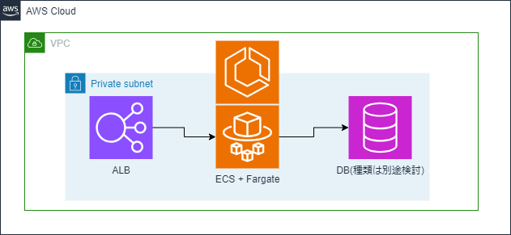
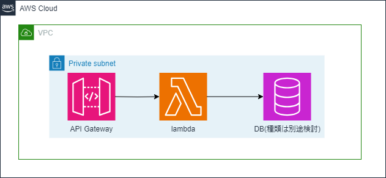

# 活動状況  
## 2023/12/07時点の状況  
### 実施したこと  
1.CloudformationでEC2環境の構築  
→Cloudformationで以下作成している。  

Stack①　Cloudformation Cloudformationを利用する環境を整えるためのStack。初回のみの実行で基本的には変更しない。  
Cloudformation資材のS3バケットや今回は未実施だがCloudformationを実行するIAM周りもここで実施の想定。  

Stack②　VPC ネットワーク周りの設定を行うStack。  
SGは変更が多いため別項目とした方が良さそう？今回は使うリソースとセットでSGを作るようにしたが、管理的に良くない？  

Stack③　EC2 今回は3構成作ってみる予定のため、構成別でStackを分割する想定。  
SSM接続用のエンドポイントは固定費かかるし、EC2利用時以外は使わない気もしたため、こちらに入れた。通常はおそらくVPCに入れる認識。  

Stack④　ECS ECSで利用するリソース作成用。現状はSGとALBのみ。  

Stackは現状上記で分割しているが、分割方針の考え方などあればご教示いただきたい。  
AWSサービス単位での分割が良いか、AP機能単位での分割が良いか。運用上、機能単位で廃止ということもありえるため機能単位の方が使いやすい？  
また、検証環境夜間停止で節約したいといった時に構成にもよるがEBSやELB分、単純停止よりもCloudformationで削除、作成の方が安い？金額的に誤差みたいなものだから話に挙がらない？  

2,ECSのハンズオン →ハンズオン実施。Dockerも初体験。  
インターネットから接続する前提のハンズオンだったため、読み替えて閉域VPCで進めていたらECSタスク作成部分でエラーとなった。  
ECSのタスク起動時にECRからコンテナイメージを取得する必要がある認識だが、これはインターネット接続必須とかあるのでしょうか？  

### 困っていること  
既に別の人が質問していたかもですが、IGWについて確認です。  
基本的にIGWは利用不可？で、Linux等で利用する時もNATGateway経由と利用者規約を読んだが、IGWのあるVPCとピアリングして使うイメージか？  
それとも許可いただいて、自分のVPCにパブリックサブネットを作成し、そこにNATGatewayとかも作って利用するイメージか？  
Cloud9利用時にインターネット接続が必要でした。yumも使うかもですし、上記ECSでも必要かもなので確認させていただければと思います。  

### 次回までのToDO 
1,ECSハンズオンの完了  
2,共有会の準備  
3,EC2構成を進める。(アプリはどこかから拾う想定)  

## 2023/11/09時点の状況  
### 前回記載した次回までのToDO
1.TERASOLUNAチュートリアルを通じてjavaの学習を行う。  
→あまり時間取れず。  
　チュートリアルそのままだとバージョン差異などで環境エラーが多発している。  
　少しずつ進めていたが、断念して「Hello World」から始めることとした。  
　https://kuramochiku.github.io/md/spring.html#intellij-idea  

2.AWSに特化したテーマの再検討(～11月末)  
→再検討を実施した。3月までのテーマとしては別途追加する予定であるが、直近としては以下としたいと考えている。  

### 直近のテーマと選定理由(～12月)
EC2/ECS/サーバレスの使い分け整理。現プロジェクトの最適構成検討。  

EC2とサーバレスの違いは分かるが、EC2とECSの使い分けについて自分の言葉で説明できない。  
実際にECSを扱ってみることで、使い分け方を整理したい。  
※コンテナの方が良いといったイメージがあるが、オーバーヘッドもあるため、EC2オートスケーリングとの優位性が分からない。  

本検証に伴う構築、設定変更はcloudformationを利用して行う方針とする。  
cloudformationを扱ったことがなく、プロジェクトでも利用出来ていないためである。  

### 想定構成図  
EC2の構成図  

ECSの構成図  

サーバレスの構成図  

### 評価観点  
・構築時に必要な作業(工数)  
・設定変更に必要な作業(工数)  
・ランニングコスト(通常時、コスト削減方法のバリエーション)  
・拡張性  
・冗長性(リリース時の影響)  
・セキュリティ担保  
・監視  
・ログ管理  
・開発者の責任範囲  
・その他  

3.上記を進めるためCloudformationを学習中。VPC、サブネット、ルートテーブルまでは作成。  

### 困っていること  
業務多忙です。。。しばらくは状況悪化する可能性の方が高いです。  

### 次回までのToDO
1.CloudformationでEC2環境の構築  