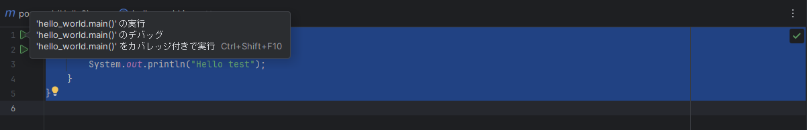

# SpringBoot入門
## SpringBootとは

## IntelliJとは
IntelliJ IDEAは、JetBrains社が開発したJavaなどの言語に対応した統合開発環境である。  

なお、IDE(統合開発環境)とはプログラマーがソフトウェアコードを効率的に開発するのに役立つソフトウェアアプリケーションであり、IDEには以下のようなメリットがある。  
・コード編集のオートメーション  
・構文の強調表示  
・インテリジェントなコード補完  
・リファクタリングのサポート  
・ローカルビルドのオートメーション  
・コンパイル  
・テスト  
・デバッグ  


## IntelliJ IDEAインストール(Windows)
1,以下サイトの右上の「ダウンロード」をクリックする。  
JetBrains：IntelliJ IDEA　https://www.jetbrains.com/ja-jp/idea/  

2,保存したexeファイルを実行し、インストールを行う。  
インストールオプションの詳細は以下となる。今回はショートカットと環境変数を追加する。  
```
Create Desktop Shortcut：IntelliJ IDEAのランチャーデスクトップショートカットを作成する
Update PATH variable：IntelliJ IDEAコマンドラインランチャーを含むディレクトリを環境変数に追加する
Update context menu：コンテキストメニューに「プロジェクトとしてフォルダーを開く」を追加する
Create Associations：特定のファイル拡張子をIntelliJ IDEAに関連付けて開く
```
3,IntelliJ IDEAの起動
スタートメニューやショートカットから「IntelliJ IDEA」を起動する。  
初回起動時にはユーザー規約画面が出るので、合意のチェックボックスにチェックを入れ、「Continue」をクリックする。  

4,ユーザ認証
初回起動時は認証を求められるため「Log in to JetBrains Account」をクリックし、ブラウザでユーザ認証を行う。

5,日本語化
「Plugins」をクリックし、検索テキストボックスに「japanese」と入力し、一覧に出てきた「Japanese Language Pack / 日本語言語パック」をインストールする。  
インストールが完了すると、IntelliJ IDEAの再起動を求められるので、再起動する。  
再起動後、日本語化されていることを確認する。  

## IntelliJ IDEAプロジェクトの作成(初心者向け)
1,Javaプロジェクトを作成する場合は、左側の「Javaモジュール」を選択し、プロジェクトで使用するSDKのバージョンを選択して「次へ」をクリックする。  
※JDKをインストールしていない場合はプロジェクトSDKの一覧に表示されないため、JDKを別途ダウンロード（AoptOpenJDKのダウンロード）するか、プロジェクトSDKの選択「Download JDK...」から対象のバージョンのJDKをインストールすること。  

2,プロジェクト名を設定し、作成をクリックする。今回は「Hello」。  


3.「src」→「main」→「java」を右クリックし、「新規」→「javaクラス」からjavaクラスを作成する。今回は「Hello_world」。  

4.コードを記載する。以下のようにmainメソッドの定義とプリント出力を記載する。  
```
public class hello_world {
    public static void main(String[] args){
        System.out.println("Hello test");
    }
}
```

5.コード実行する。コードにエラーが無い状態だと行数の隣に▶マークが表示されるため、クリックしてポップアップ表示される「'helloworld.main()'」を選択する。  


```
C:\Users\xxxx\.jdks\openjdk-21.0.1\bin\java.exe "-javaagent:C:\Program Files\JetBrains\IntelliJ IDEA 2023.2.3\lib\idea_rt.jar=62291:C:\Program Files\JetBrains\IntelliJ IDEA 2023.2.3\bin" -Dfile.encoding=UTF-8 -Dsun.stdout.encoding=UTF-8 -Dsun.stderr.encoding=UTF-8 -classpath C:\zyuku\test\Hello2\target\classes hello_world
Hello test

プロセスは終了コード 0 で終了しました
```

6.jarファイルにパッケージする。  
ファイル→プロジェクト構造に移動し、アーティファクトをクリックする。  
「+」→「java」→「依存関係を持つモジュールから」をクリックする。  


## RESTとは
REpresentational State Transferの略称であり、以下4つの特徴を持つAPIをRESTful API(REST API)と言う。  
* ステートレスなクライアント/サーバプロトコル  
⇒セッションなどの状態管理を行わない。やり取りされる情報はそれ自体で完結する。  

* リソースを一意なURIにより識別される  
⇒URI（Uniform Resource Identifier）で表現されるユニークなアドレスを持つ。  

* HTTPメソッドで操作方法を表現した統一されたインターフェース  
⇒あらかじめ定義・共有された方法でやり取りされる。送信側はGET・POST・PUT・DELETE等のHTTPメソッドで送信し、受信側はJSON形式に返却する、など。  

* アプリケーション情報と状態遷移の両方を扱えるハイパーメディアの使用  
⇒情報の内部に、別の情報や(その情報の別の)状態へのリンクを含めることができる。

## アノテーションとは
「アノテーション」は直訳すると「注釈」である。  
Java開発でのアノテーションはコードに注釈として補足を加えることで、プログラムの動作を変更したり、開発時のルールを統一できたり、フレームワークに処理を指示したりできる仕組み。  

@RestController  
APIのコントローラに付与し、戻り値をStringにしたものがそのままクライアントへのレスポンスとなる。  
RESTAPIを作成する時、該当クラスに本アノテーションを付与すると、returnの値がcurl実行時の返却値となった。  

## エラーについて
### illegal start of type
SpringでHello Worldを出力しようとチャレンジ中に以下のような簡易クラスを作成してコンパイルするも
```
public class Hello_rest {
    System.out.println("Hello, World!"); 
}
```
以下エラーが出力  
```
illegal start of type
```
「System.out.println」はSpringで使えないのかもしれない。

```
public class Hello_rest {
    @RequestMapping("/test")
    String home() {
        return "Hello World!";
    }
}
```
と記載することで、「 curl "http://localhost:8080/test" 」接続時に「Hello World!」と返却された。  

### symbol無いよエラー
spring公式のサンプルコードを改良しつつ、コード作成にトライしていた時  
見よう見まねでアノテーション「SpringBootApplication」を使ったが以下エラーが出力。  

```
 ./mvnw spring-boot:run
中略
[ERROR] /home/ec2-user/environment/TestRest/initial/src/main/java/com/example/restservice/TestKK.java:[3,2] cannot find symbol
[ERROR]   symbol: class SpringBootApplication
```

mavenの使い方の問題かもしれないが、以下のようなimportが必要だった。  
```
import org.springframework.boot.SpringApplication;
```
